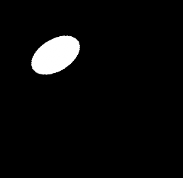

# tf_ThinPlateSpline
TensorFlow implementation of Thin Plate Spline (TPS) Spatial Transformer Network (STN). The old version implementation based on [STN paper](https://arxiv.org/abs/1506.02025) is [TPS_STN](https://github.com/iwyoo/TPS_STN-tensorflow). This implmentation, however, can work with non-fixed control points. Each solution of TPS system is dynamically calculated every feed-forward step.

```
Usage :
  V = ThinPlateSpline(U, coord, vector, out_size)
  V = ThinPlateSpline2(U, source, target, out_size)

Args :
  U : float Tensor [num_batch, height, width, num_channels].
    Input Tensor.
  coord : float Tensor [num_batch, num_point, 2]
    Relative coordinates of the control points.
  vector : float Tensor [num_batch, num_point, 2]
    The vector on the control points.
  out_size: tuple of two integers [height, width]
    The size of the output of the network (height, width)

  For version 2.
    source : float Tensor [num_batch, num_point, 2]
      Relative coordinates of the source points.
    target : float Tensor [num_batch, num_point, 2]
      Relative coordinates of the target points.

```

## Example
```python
# test.py
p = np.array([
  [-0.5, -0.5],
  [0.5, -0.5],
  [-0.5, 0.5],
  [0.5, 0.5]])

v = np.array([
  [0.2, 0.2],
  [0.4, 0.4],
  [0.6, 0.6],
  [0.8, 0.8]])

p = tf.constant(p.reshape([1, 4, 2]), dtype=tf.float32)
v = tf.constant(v.reshape([1, 4, 2]), dtype=tf.float32)
t_img = tf.constant(img.reshape(shape), dtype=tf.float32)
t_img = ThinPlateSpline(t_img, p, v, out_size)
```
 original.png

 transformed.png


### Update. (Another version TPS)
```python
# test2.py
s_ = np.array([ # source position
  [-0.5, -0.5],
  [0.5, -0.5],
  [-0.5, 0.5],
  [0.5, 0.5]])

t_ = np.array([ # target position
  [-0.3, -0.3],
  [0.3, -0.3],
  [-0.3, 0.3],
  [0.3, 0.3]])

s = tf.constant(s_.reshape([1, 4, 2]), dtype=tf.float32)
t = tf.constant(t_.reshape([1, 4, 2]), dtype=tf.float32)
t_img = tf.constant(img.reshape(shape), dtype=tf.float32)
t_img = ThinPlateSpline2(t_img, s, t, out_size)
```
 original.png

 transformed2.png

## References
- [Robust Scene Text Recognition with Automatic Rectification] (https://arxiv.org/abs/1603.03915)
- [Spatial Transformer Network] (https://arxiv.org/abs/1506.02025)
- [TensorFlow STN implementation](https://github.com/daviddao/spatial-transformer-tensorflow/blob/master/spatial_transformer.py)
- [Thin Plate Spline with control points on regular grid implementation](https://github.com/iwyoo/TPS_STN-tensorflow)
